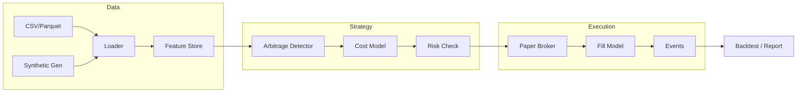

# Arbitrage-AI-Bot

> **AI-assisted arbitrage research lab** — Simulated execution, paper trading, reproducible experiments.

[](https://github.com/tiagofndn/Arbitrage-AI-Bot/actions/workflows/ci.yml)
[](https://github.com/tiagofndn/Arbitrage-AI-Bot/actions/workflows/docs.yml)
[](https://opensource.org/licenses/MIT)
[](https://www.python.org/downloads/)
[](https://github.com/psf/black)

---

## Overview

**Arbitrage-AI-Bot** is an educational, simulation-first framework for researching cross-venue arbitrage. It helps developers learn about market microstructure, latency, slippage, and decision-making—without risking real capital or connecting to live exchanges by default.

### Key Features

- **Simulate-first**: Synthetic market data generator and CSV/Parquet ingestion
- **Paper trading**: Realistic fill simulation with fees, slippage, and partial fills
- **Cost model**: Fees, latency, inventory risk, and depth-aware slippage
- **Risk management**: Max exposure, kill switch, drawdown limits, circuit breaker
- **AI assistive policy**: Offline threshold suggestions with human-readable rationale
- **Backtesting**: Walk-forward validation, Monte Carlo on slippage/latency
- **Reproducible**: Seeded synthetic data, config-driven experiments, report export

### Screenshots

<!-- Placeholder: Add screenshots of CLI output, dashboard, or reports to docs/assets/ -->
*Example backtest report: run `ai-arb-lab backtest` and open `reports/backtest_report.md`*

---

## Architecture

```
┌─────────────────────────────────────────────────────────────────────────────┐
│                           AI ARB LAB - HIGH LEVEL                           │
├─────────────────────────────────────────────────────────────────────────────┤
│                                                                             │
│   ┌──────────────┐    ┌──────────────┐    ┌──────────────┐                 │
│   │   DATA       │    │   STRATEGY   │    │   EXECUTION  │                 │
│   │   LAYER      │───▶│   LAYER      │───▶│   LAYER      │                 │
│   │              │    │              │    │              │                 │
│   │ • Synthetic  │    │ • Arbitrage  │    │ • Paper      │                 │
│   │ • CSV/Parquet│    │   detector   │    │   broker     │                 │
│   │ • Features   │    │ • Cost model │    │ • Fill model │                 │
│   └──────────────┘    └──────┬───────┘    └──────────────┘                 │
│                              │                                              │
│                              ▼                                              │
│   ┌──────────────┐    ┌──────────────┐    ┌──────────────┐                 │
│   │   RISK       │    │   AI         │    │   EVALUATION │                 │
│   │   LAYER      │    │   LAYER      │    │   LAYER      │                 │
│   │              │    │              │    │              │                 │
│   │ • Limits     │    │ • Policy     │    │ • Backtest   │                 │
│   │ • Kill switch│    │ • Explain    │    │ • Metrics    │                 │
│   │ • Circuit    │    │ • Fallback   │    │ • Reports    │                 │
│   └──────────────┘    └──────────────┘    └──────────────┘                 │
│                                                                             │
│   ┌─────────────────────────────────────────────────────────────────────┐  │
│   │                    EVENT BUS (async, in-memory)                      │  │
│   └─────────────────────────────────────────────────────────────────────┘  │
└─────────────────────────────────────────────────────────────────────────────┘
```

### Data Flow (Mermaid)



---

## Quickstart

### Prerequisites

- Python 3.12+
- pip or uv

### Install

```bash
git clone https://github.com/tiagofndn/Arbitrage-AI-Bot.git
cd Arbitrage-AI-Bot
pip install -e ".[dev]"
cp .env.example .env
```

### Generate Sample Data

```bash
ai-arb-lab generate-data --output data/sample --days 1 --seed 42
```

### Run a Backtest

```bash
ai-arb-lab backtest --data-dir data/sample --output reports/
```

### Run Paper Trading (Simulation)

```bash
ai-arb-lab paper-run --data-dir data/sample --duration 60
```

### Generate a Report

```bash
ai-arb-lab report --input reports/backtest_*.json --output reports/summary.md
```

---

## How It Works

1. **Data**: Load synthetic or historical CSV/Parquet. The synthetic generator creates multi-venue orderbooks with configurable spreads and volatility.
2. **Strategy**: The arbitrage detector finds cross-venue price discrepancies. A cost model applies fees, slippage, and latency.
3. **Risk**: Limits on exposure, drawdown, and a kill switch gate every signal.
4. **AI (optional)**: A policy module suggests thresholds from offline training on synthetic data. Every suggestion includes a rationale; deterministic fallbacks exist if AI is disabled.
5. **Execution**: The paper broker simulates fills with partial fills and realistic latency.
6. **Evaluation**: Backtest metrics, walk-forward validation, and Monte Carlo stress tests produce HTML/Markdown reports.

---

## What This Project Is NOT

- **Not a live trading system**: No real exchange execution by default. Connectors are stubbed interfaces.
- **Not a signal service**: No guarantees of profitability. For education and research only.
- **Not compliant-by-default for production**: Users must ensure their use case complies with local regulations and exchange ToS.
- **Not a way to evade rate limits or exchange rules**: We emphasize compliance and responsible API usage.
- **Not suitable for leveraged/margin trading** in any production capacity.

---

## Project Structure

```
Arbitrage-AI-Bot/
├── src/ai_arb_lab/          # Main package
│   ├── core/                # Events, bus, clock
│   ├── data/                # Loaders, synthetic generator
│   ├── strategies/          # Strategy base, simple spread
│   ├── risk/                # Limits, kill switch
│   ├── execution/           # Fill model, paper broker
│   ├── ai/                  # Policy, explainability
│   ├── reporting/           # Metrics, report render
│   └── cli.py               # Typer CLI
├── tests/
├── examples/
├── docs/                    # MkDocs site
├── data/sample/             # Sample synthetic data
├── reports/                 # Generated reports
├── scripts/                 # Helper scripts
├── docker-compose.yml       # Optional services
├── pyproject.toml
└── Makefile
```

---

## Configuration

Copy `.env.example` to `.env` and adjust. Key variables:

| Variable | Description |
|----------|-------------|
| `DATA_DIR` | Path to sample/synthetic data |
| `BACKTEST_INITIAL_CAPITAL` | Starting capital for backtests |
| `PAPER_MODE` | Always `simulated` in this repo |
| `LOG_LEVEL` | `DEBUG`, `INFO`, `WARNING`, `ERROR` |

See [docs/configuration.md](docs/configuration.md) for full reference.

---

## Safety & Compliance

- **Simulation by default**: All execution is simulated. No real orders are sent.
- **No secrets in examples**: Never commit API keys. Use `.env` and never add it to git.
- **Exchange ToS**: If you integrate real connectors, you must comply with each exchange's Terms of Service and rate limits.
- **Regulatory**: This software does not constitute financial advice. Users are responsible for their own compliance.

See [docs/security_and_compliance.md](docs/security_and_compliance.md) for details.

---

## Documentation

Full documentation is built with MkDocs Material:

```bash
make docs
# Open http://127.0.0.1:8000
```

Or read the source in `docs/`:

- [Quickstart](docs/quickstart.md)
- [Architecture](docs/architecture.md)
- [Data Pipeline](docs/data_pipeline.md)
- [Strategies](docs/strategies.md)
- [Risk Management](docs/risk_management.md)
- [Paper Trading](docs/paper_trading.md)
- [AI Module](docs/ai_module.md)
- [Security & Compliance](docs/security_and_compliance.md)

---

## Development

```bash
make install-dev   # Install with dev deps
make lint          # Ruff
make format        # Black + Ruff format
make typecheck     # Mypy
make test          # Pytest
make test-cov      # Coverage
```

---

## Optional Services (Docker)

Postgres, Redis, Prometheus, and Grafana are available via Docker Compose:

```bash
docker compose --profile optional up -d
```

These are **optional**; the lab runs fully without them using in-memory state.

---

## FAQ

**Q: Can I use this for live trading?**  
A: No. This repo provides simulation and paper trading only. Live trading is explicitly out of scope.

**Q: Where do I get real market data?**  
A: Use the synthetic generator or your own CSV/Parquet. Real data ingestion would require your own compliant integration.

**Q: Is the AI module required?**  
A: No. Deterministic fallback rules work without AI. The AI layer is assistive only.

**Q: How do I add a new strategy?**  
A: Extend `strategies/base.py` and register your strategy. See [docs/strategies.md](docs/strategies.md).

**Q: What about exchange connectors?**  
A: We provide interfaces and mock implementations. Real connectors must be implemented by users, with full awareness of ToS and rate limits. See [docs/security_and_compliance.md](docs/security_and_compliance.md). See [docs/security_and_compliance.md](docs/security_and_compliance.md).

---

## License

MIT. See [LICENSE](LICENSE).

---

## Acknowledgments

Built for developers and researchers who want to learn about market microstructure, latency, slippage, and decision-making in a safe, reproducible environment.
