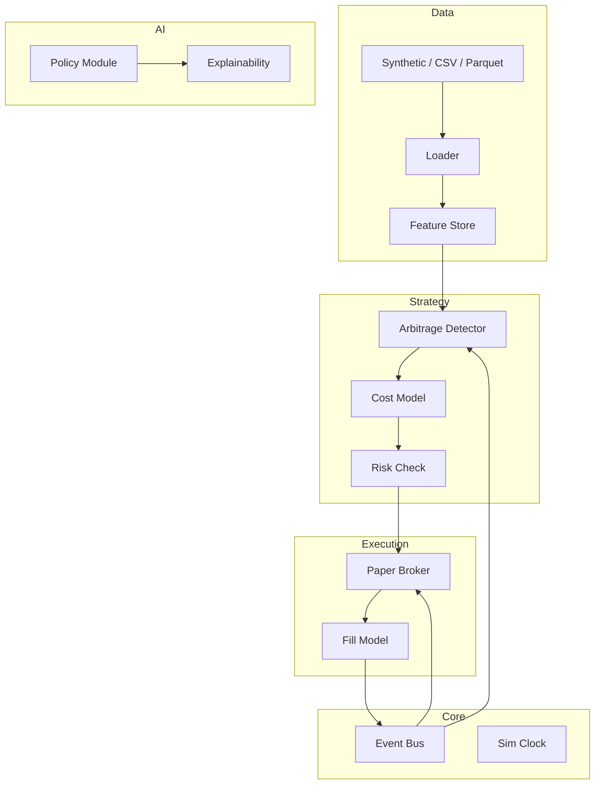
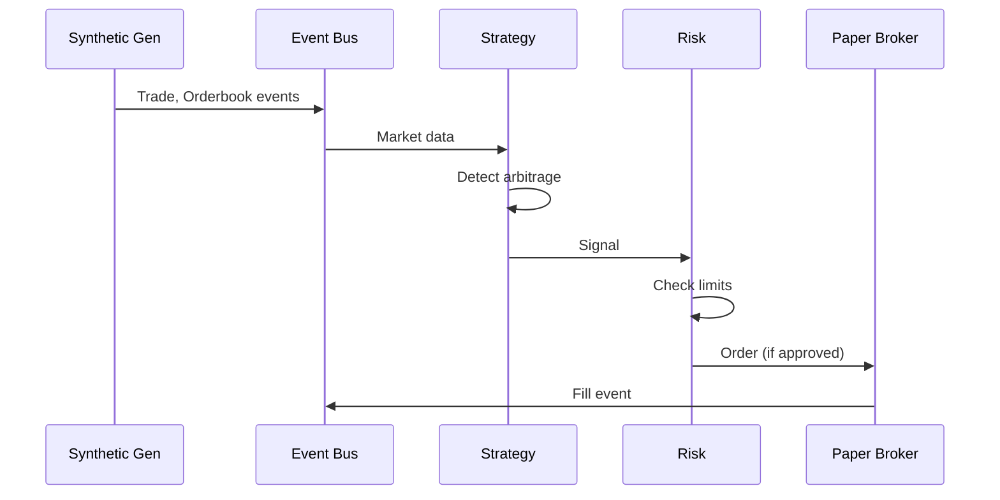

# Architecture

AI Arb Lab uses an event-driven, async architecture with clear separation between data, strategy, risk, execution, and evaluation.

## High-Level Overview



## Components

### Core

| Component | Purpose |
|-----------|---------|
| **Event Bus** | In-memory async message bus. Events: `Trade`, `Orderbook`, `Signal`, `Fill`, etc. |
| **Sim Clock** | Controls simulation time. Supports replay and speed-up. |
| **Events** | Typed dataclasses (Pydantic) for all domain events. |

### Data Layer

- **Schema**: Trades, orderbooks, candles (OHLCV)
- **Ingest**: CSV, Parquet, synthetic generator
- **Feature Store**: Rolling features, volatility, spreads, depth, imbalance

### Strategy Layer

- **Arbitrage Detector**: Cross-venue price discrepancy detection
- **Cost Model**: Fees, slippage, latency, partial fills, inventory risk
- **Risk Management**: Max exposure, kill switch, drawdown limits, circuit breaker

### AI Layer (Assistive)

- **Policy Module**: Offline-trained threshold suggestions on synthetic data
- **Explainability**: Human-readable rationale for every suggestion
- **Fallback**: Deterministic rules when AI is disabled

### Execution Layer

- **Paper Broker**: Simulates order submission and fills
- **Fill Model**: Realistic partial fills, slippage, latency

### Evaluation Layer

- **Backtesting**: Replay events, compute metrics
- **Walk-Forward**: Time-split validation
- **Monte Carlo**: Slippage/latency stress tests
- **Reports**: HTML/Markdown export

## Event Flow



## Data Flow (ASCII)

```
┌─────────────┐     ┌─────────────┐     ┌─────────────┐
│   SOURCE    │────▶│   LOADER    │────▶│   FEATURES  │
│ CSV/Parquet │     │             │     │   Rolling   │
│ Synthetic   │     │             │     │   Spreads   │
└─────────────┘     └─────────────┘     └──────┬──────┘
                                               │
                                               ▼
┌─────────────┐     ┌─────────────┐     ┌─────────────┐
│   REPORT    │◀────│   METRICS   │◀────│   STRATEGY  │
│ HTML/MD     │     │   Backtest  │     │   Detector  │
└─────────────┘     └─────────────┘     └──────┬──────┘
                                               │
                                               ▼
┌─────────────┐     ┌─────────────┐     ┌─────────────┐
│   FILLS     │────▶│   BROKER    │◀────│   RISK      │
│   Events    │     │   Paper     │     │   Limits    │
└─────────────┘     └─────────────┘     └─────────────┘
```

## Concurrency

- **Async event loop**: All I/O and event handling is async
- **In-memory bus**: No external message queue required (Redis optional)
- **Single-threaded by default**: Deterministic, reproducible

## Extensibility

- **Strategies**: Extend `BaseStrategy`, implement `evaluate()`
- **Connectors**: Implement `MarketDataConnector` interface (mock provided)
- **Fill models**: Pluggable `FillModel` for different slippage assumptions
