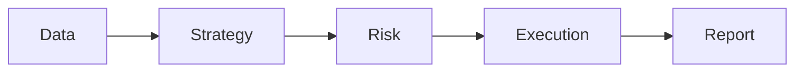

# Arbitrage-AI-Bot

**AI-assisted arbitrage research lab** — Simulated execution, paper trading, reproducible experiments.

## What Is This?

AI Arb Lab is an educational framework for researching cross-venue arbitrage. It helps developers learn about:

- **Market microstructure** — orderbooks, spreads, depth, imbalance
- **Latency** — simulation of network and processing delays
- **Slippage** — realistic fill models with partial fills
- **Decision-making** — cost models, risk limits, and assistive AI

Everything runs in **simulation** by default. No real exchange connections, no live trading.

## Quick Links

| Topic | Description |
|-------|-------------|
| [Quickstart](quickstart.md) | Get running in minutes |
| [Architecture](architecture.md) | System design and data flow |
| [Data Pipeline](data_pipeline.md) | Synthetic data, loaders, features |
| [Strategies](strategies.md) | Arbitrage detection, cost model |
| [Risk Management](risk_management.md) | Limits, kill switch, circuit breaker |
| [Paper Trading](paper_trading.md) | Fill simulation, paper broker |
| [AI Module](ai_module.md) | Assistive policy, explainability |
| [Security & Compliance](security_and_compliance.md) | Safe usage, ToS, regulations |

## Core Concepts



1. **Data** — Synthetic or CSV/Parquet market data
2. **Strategy** — Detect arbitrage opportunities, apply cost model
3. **Risk** — Enforce limits before any simulated trade
4. **Execution** — Paper broker with realistic fills
5. **Report** — Metrics, backtest results, HTML/Markdown

## Installation

```bash
pip install -e ".[dev]"
cp .env.example .env
```

## First Run

```bash
ai-arb-lab generate-data --output data/sample --days 1 --seed 42
ai-arb-lab backtest --data-dir data/sample --output reports/
```

## License

MIT. See [LICENSE](https://github.com/tiagofndn/Arbitrage-AI-Bot/blob/main/LICENSE) in the repository.
