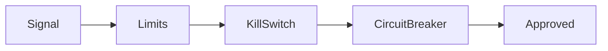

# Risk Management

Risk controls gate every signal before simulated execution. They are mandatory in the pipeline.

## Components

### Limits

| Limit | Description |
|-------|-------------|
| **Max exposure** | Maximum notional value in open positions |
| **Max drawdown** | Stop if drawdown exceeds threshold (e.g., 10%) |
| **Max daily loss** | Stop if daily P&L below threshold |
| **Position limits** | Max position size per symbol/venue |

### Kill Switch

- **Manual**: Can be triggered programmatically
- **Automatic**: Triggers on drawdown or daily loss breach
- **Effect**: Stops all new orders; existing orders are not cancelled (simulation)

### Circuit Breaker

- Pauses strategy evaluation for a cooldown period after N consecutive losses
- Configurable: `cooldown_seconds`, `loss_threshold`

## Flow



If any check fails, the signal is rejected and no order is sent.

## Configuration

Set limits via environment or config:

```python
# Example (pseudo-config)
risk:
  max_exposure: 100000
  max_drawdown_pct: 0.10
  max_daily_loss: 5000
  kill_switch_enabled: true
  circuit_breaker:
    cooldown_seconds: 60
    loss_threshold: 3
```
